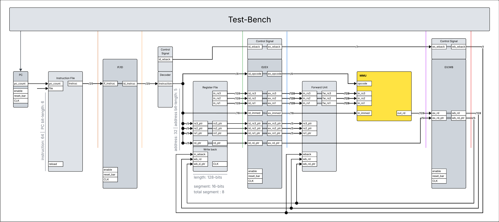
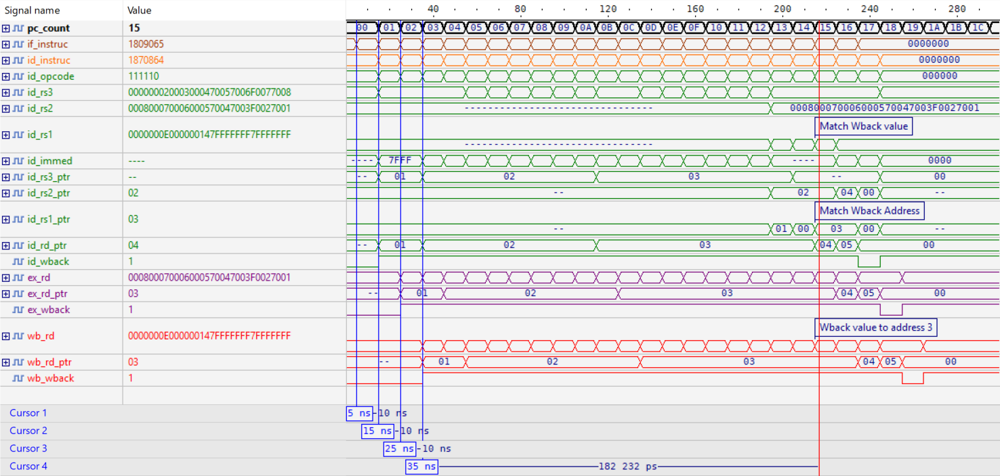
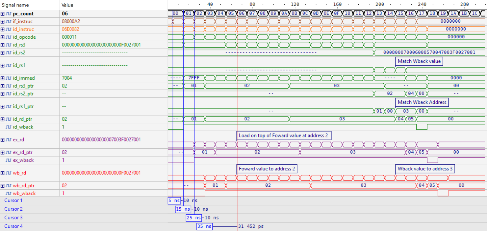
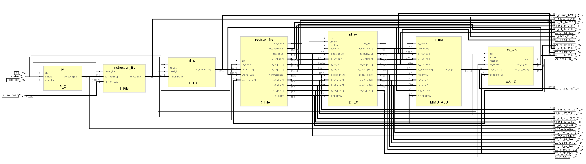

# Pipelined SIMD Multimedia Processor (RTL, VHDL)
**A 4-stage pipelined multimedia processor core implemented in structural VHDL, featuring a SIMD-style register file, a reduced multimedia/MMU instruction subset, and a full IF → ID → EX → WB datapath with forwarding.**

<div align="center">

[](https://en.wikipedia.org/wiki/VHDL)
[](https://en.wikipedia.org/wiki/Logic_simulation)
[](https://en.wikipedia.org/wiki/Instruction_pipelining)
[](https://www.xilinx.com/products/silicon-devices/fpga/artix-7.html)
[](https://digilent.com/reference/programmable-logic/basys-3/start)
[](https://www.xilinx.com/products/design-tools/vivado.html)
[](rtl/mmu_simple_v2/USART_Unit_VHDL/USART_unit.vhd)

**May 2026 | Jin Yuan Chen**

</div>

---

<p align="center">
  
</p>
<p align="center">
  <em>Figure 1: Structural RTL diagram of the 4-stage pipeline datapath (IF/ID/EX/WB) including inter-stage registers, forwarding path, and MMU execution block.</em>
</p>

## Overview

This repository contains an RTL implementation of a **four-stage pipelined multimedia processor** written in VHDL. The design models a compact, SIMD-inspired execution core (conceptually similar to subsets of Cell SPU / Intel SSE-style operations) where each instruction traverses:

- **IF**: instruction fetch
- **ID**: instruction decode + register file read
- **EX**: multimedia execution unit (MMU/ALU)
- **WB**: write-back to the register file

The emphasis is on **verification-first RTL development**: each stage/block has a dedicated testbench, then the full IF→ID→EX→WB pipeline is validated end-to-end with a top-level integration test. The `mmu_simple_v2` flow also supports **terminal-programmable instruction loading** via **UART-over-JTAG**.

---

## Architecture (RTL hierarchy)

The primary top-level entity is `Multimedia_Processor_Unit` (see `rtl/mmu_simple_v2/mmu_cpu/Multimedia_Processor_Unit.vhd` and `rtl/mmu_simple_v1/Multimedia_Processor_Unit.vhd`).

At a high level, the core is built as a structural hierarchy:

```
Multimedia_Processor_Unit (top)
├── s1_instruction_fetch/
│   ├── instruction_file      — Instruction memory / BRAM interface (v2 supports external muxed BRAM)
│   └── pc / pc_count         — Program counter (present in v1 flow)
├── s2_instruction_decode/
│   ├── if_id                 — IF→ID inter-stage register
│   ├── decoder               — Opcode + operand pointer decode
│   └── register_file         — SIMD-style register file read/write + debug readout hooks
├── s3_execution/
│   ├── id_ex                 — ID→EX inter-stage register
│   ├── forward               — WB→EX bypass network for data hazards
│   ├── mmu                   — Multimedia execution core (opcode dispatch)
│   └── operation_package/    — Behavioral procedures implementing instruction groups
│       ├── load_immediate.vhd
│       ├── saturate_math.vhd
│       └── rest_instruction.vhd
└── s4_wback/
    └── ex_wb                 — EX→WB inter-stage register (dest reg pointer + data + write-enable)
```

---

## RTL design logic

This section summarizes the implementation as documented in the course report: [`docs/datasheets/ESE345_Project_Report_2.pdf`](docs/datasheets/ESE345_Project_Report_2.pdf).

### `pc` + `instruction_file` — Instruction fetch (IF stage)
The program counter increments on each enabled rising clock edge and addresses a 64-deep instruction store to fetch a 25-bit instruction word into the IF/ID register. A practical convention used in the documentation is to keep the last instruction as a **NOP** to avoid unintended behavior once the PC reaches its max count.

### `decoder` — Instruction field decode (ID stage)
Parses the 25-bit instruction into the **opcode**, register pointers (`rs*`, `rd`), 16-bit immediate, and control signals (notably **write-back enable**) for the downstream register file / execute stage.

### `register_file` — SIMD register file (ID/WB boundary)
Implements the processor’s register storage and access patterns:

- **ID read**: supplies 128-bit `rs1/rs2/rs3` operand vectors (32 registers × 128-bit)
- **WB write**: commits `rd` on `wb_wback` (via the EX/WB stage register)
- **Debug readout**: exposes a probe-style interface (e.g., `reg_tog`, address/segment selection) to observe register contents

### `if_id`, `id_ex`, `ex_wb` — Inter-stage pipeline registers
Buffers each clock cycle between pipeline stages (IF/ID, ID/EX, EX/WB). This enforces deterministic stage boundaries and prevents long combinational paths.

### `forward` — WB→EX hazard bypass
Compares EX source pointers (`ex_rs*_ptr`) against the WB destination pointer (`wb_rd_ptr`) and, when `wb_wback = '1'`, forwards the newest `wb_rd` into the EX operands (`fw_rs*`) to avoid RAW hazards.

### `mmu` — Multimedia execution core (EX stage)
Dispatches instruction behavior based on opcode groups. In `mmu_simple_v2`, the EX logic delegates to procedure packages such as:

- `operation_package/load_immediate.vhd`
- `operation_package/saturate_math.vhd`
- `operation_package/rest_instruction.vhd`

This keeps the EX datapath readable while allowing the instruction set to be extended by adding/adjusting procedures.

---

## Synthesis & verification

### Verification (waveforms + testbenches)


> Simulation waveform illustrating write-back behavior and destination register updates across pipeline stages.


> Simulation waveform showing WB→EX forwarding in action (operand matches `wb_rd_ptr`, forwarded data aligns with the write-back value).


**Test-Bench** — bottom-up RTL simulation (VHDL testbenches):

| Level | Where | What was validated |
|-------|--------|-------------------|
| **Block** | `rtl/mmu_simple_v*/**/verification/` | Each pipeline stage and MMU opcode group in isolation |
| **Core** | `sim/tb/mmu_simple_v1/`, `rtl/mmu_simple_v2/mmu_cpu/*_tb.vhd` | Full 4-stage IF→WB datapath (v1 & v2) |
| **Peripheral** | `rtl/mmu_simple_v2/usart_rx/verification/` | UART program loader |
| **System** | `sim/tb/mmu_simple_v2/Processor_Controller_tb.vhd` | FPGA top: CPU + memory + USART load FSM |

### Synthesis (RTL view)

> Synthesis-oriented RTL hierarchy view showing the main instantiated blocks and top-level connectivity.

---

## Notes

- This project intentionally prioritizes **clarity and module boundaries** over micro-optimizations.
- The EX stage is structured so new operations can be added by extending the `operation_package/` procedures and wiring decode fields consistently.
